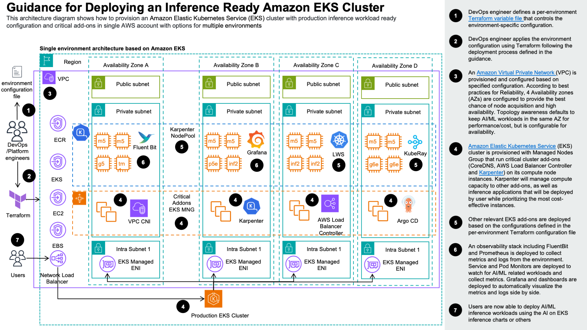

# Inference ready Amazon EKS Cluster

## Table of Contents

- [Overview](#overview)
- [Architecture](#architecture)
- [Architecture Steps](#architecture-steps)
- [Plan Your Deployment](#plan-your-deployment)
  - [AWS Services in this Guidance](#aws-services-in-this-guidance)
  - [Cost](#cost)
  - [Sample Cost Table](#sample-cost-table)
- [Quick Start Guide](#quick-start-guide)
    - [Important Setup Instructions](#-important-setup-instructions)
    - [Deploy the Infrastructure](#deploy-the-infrastructure)
    - [Deploying Models](#deploying-models)
      - [Prerequisites](#prerequisites)
      - [Create a Hugging Face Token](#how-to-create-a-hugging-face-token)
      - [Create a Cluster Secret](#create-the-cluster-secret)
      - [Deploy the Model](#deploy-a-model)
- [Monitoring and Observability](#-monitoring-and-observability)

## Overview

This solution implements a comprehensive, scalable ML inference architecture using Amazon EKS, leveraging both AWS
Neuron processors for cost-effective, accelerated inference, and GPU instances for traditional inference. The system
provides a complete end-to-end platform for deploying large language models and generative AI capabilities along with
observability support.

## Architecture



The architecture diagram illustrates our scalable ML inference solution with the following components:

- **Amazon EKS Cluster**: The foundation of our architecture, providing a managed Kubernetes environment with automated
  provisioning and configuration.

- **Karpenter Auto-scaling**: Dynamically provisions and scales compute resources based on workload demands across
  multiple node pools.

- **Node Pools**:
    - **Neuron-based nodes**: Cost-effective Neuron inference using inf2/trn1 instances
    - **GPU-based nodes**: High-performance inference using NVIDIA GPU instances (g5, g6 families)
    - **x86-based nodes**: General purpose compute for compatibility requirements

- **Model Hosting Services**:
    - **Ray Serve**: Distributed model serving with automatic scaling
    - **Standalone Services**: Direct model deployment for specific use cases
    - **Multi-modal Support**: Text, vision, and reasoning model capabilities
    - **AIBrix**: Distributed KV Caching for resource sharing
    - **LWS**: Multinode distributed inference for very large models

- **Observability & Monitoring**:
    - **Prometheus & Grafana**: Infrastructure monitoring and alerting
    - **Dashboards**: Built-in AI/ML workload specific dashboards

This architecture provides flexibility to choose between cost-optimized inference on Neuron processors or
high-throughput GPU inference based on your specific requirements, all while maintaining elastic scalability through
Kubernetes and Karpenter.

## Architecture Steps

- **Foundation Setup**: The foundation begins with an Amazon EKS cluster, configured for application readiness and with
  compute plane managed by Karpenter. This setup efficiently supports both AWS Neuron and GPU based instances
  across multiple Availability Zones (AZs), ensuring robust infrastructure distribution and high availability of
  various Kubernetes services with increased node acquisition success.

- **Model Deployment**: The architecture natively supports
  the [AI on EKS inference charts](../../../blueprints/inference/inference-charts) for easy deployment of many models
  using various accelerators or frameworks. You may also opt to bring your own model.

## Plan your deployment

### AWS services in this Guidance

| **AWS Service** | **Role** | **Description** |
|-----------------|----------|-----------------|
| [Amazon Elastic Kubernetes Service](https://aws.amazon.com/eks/) ( EKS) | Core service | Manages the Kubernetes control plane and worker nodes for container orchestration. |
| [Amazon Elastic Compute Cloud](https://aws.amazon.com/ec2/) (EC2) | Core service | Provides the compute instances for EKS worker nodes and runs containerized applications. |
| [Amazon Virtual Private Cloud](https://aws.amazon.com/vpc/) (VPC) | Core Service | Creates an isolated network environment with public and private subnets across multiple Availability Zones. |
| [Amazon Elastic Container Registry](http://aws.amazon.com/ecr/) (ECR) | Supporting service | Stores and manages Docker container images for EKS deployments. |
| [Elastic Load Balancing](https://aws.amazon.com/elasticloadbalancing/) (NLB) | Supporting service | Distributes incoming traffic across multiple targets in the EKS cluster. |
| [Amazon Elastic Block Store](https://aws.amazon.com/ebs) (EBS) | Supporting service | Provides persistent block storage volumes for EC2 instances in the EKS cluster. |
| [AWS Key Management Service](https://aws.amazon.com/kms/) (KMS) | Security service | Manages encryption keys for securing data in EKS and other AWS services. |

### Cost

You are responsible for the cost of the AWS services used while running this guidance.
As of August 2025, the cost for running this guidance with the default settings in the US West (Oregon) Region is
approximately **$96.21/month**.

We recommend creating a [budget](https://alpha-docs-aws.amazon.com/awsaccountbilling/latest/aboutv2/budgets-create.html)
through [AWS Cost Explorer](http://aws.amazon.com/aws-cost-management/aws-cost-explorer/) to help manage costs. Prices
are subject to change. For full details, refer to the pricing webpage for each AWS service used in this guidance.

### Sample cost table

The following table provides a sample cost breakdown for deploying this guidance with the default parameters in the
`us-west-2` (Oregon) Region for one month. This estimate is based on the AWS Pricing Calculator output for the full
deployment as per the guidance. This **does not** factor any model deployments on top of the running environment.

| **AWS service**                  | Dimensions                        | Cost, month [USD] |
|----------------------------------|-----------------------------------|-------------------|
| Amazon EKS                       | 1 cluster                         | $73.00            |
| Amazon VPC                       | 1 NAT Gateways                    | $33.75            |
| Amazon EC2                       | 2 m5.large instances              | $156.16           |
| Amazon EBS                       | gp3 storage volumes and snapshots | $7.20             |
| Elastic Load Balancer            | 1 NLB for workloads               | $16.46            |
| Amazon VPC                       | Public IP addresses               | $3.65             |
| AWS Key Management Service (KMS) | Keys and requests                 | $6.00             |
| **TOTAL**                        |                                   | **$296.21/month** |

For a more accurate estimate based on your specific configuration and usage patterns, we recommend using
the [AWS Pricing Calculator](https://calculator.aws).

## Quick Start Guide

The solution comes in two parts:

- The infrastructure for running inference workloads (this)
- The models that can be deployed on top of a running environment (
  the [inference charts](../../../blueprints/inference/inference-charts))

### ⚠️ Important Setup Instructions

**Before proceeding with this solution, ensure you have:**

- **AWS CLI configured** with appropriate permissions for EKS, ECR, CloudFormation, and other AWS services
- **kubectl installed** and configured to access your target AWS region
- **Sufficient AWS service quotas** - This solution requires multiple EC2 instances, EKS cluster, and other AWS
  resources

**Recommended Setup Verification:**

```bash
# Verify AWS CLI access
aws sts get-caller-identity

# Verify kubectl installation
kubectl version --client

# Check available AWS regions and quotas
aws ec2 describe-regions
aws service-quotas get-service-quota --service-code ec2 --quota-code L-1216C47A
```

**Cost Awareness:** This solution will incur AWS charges. Review the cost breakdown section below and set up billing
alerts before deployment.

### Deploy the Infrastructure

The following is a quick way to deploy the infrastructure. It will create everything and return the command to configure
`kubectl` for this cluster. Note, it will take about 15 minutes to run.

```bash
git clone https://github.com/awslabs/ai-on-eks.git
cd ai-on-eks
cd infra/solutions/inference-ready-cluster
./install.sh
```

### Deploying models

#### Prerequisites

- EKS cluster set up following the steps above
- `kubectl` configured to access your cluster
- a Hugging Face Token
- a configured secret from the Hugging Face Token

#### How to create a Hugging Face Token

To access Hugging Face models, you'll need to create an access token:

1. **Sign up or log in** to [Hugging Face](https://huggingface.co/)
2. **Navigate to Settings**: Click on your profile picture in the top right corner and select "Settings"
3. **Access Tokens**: In the left sidebar, click on "Access Tokens"
4. **Create New Token**: Click "New token" button
5. **Configure Token**:
    - **Name**: Give your token a descriptive name (e.g., "EKS-ML-Inference")
    - **Type**: Select "Read" for most use cases (allows downloading models)
    - **Repositories**: Leave empty to access all public repositories, or specify particular ones
6. **Generate Token**: Click "Generate a token"
7. **Copy and Store**: Copy the generated token immediately and store it securely

**Important Notes**:

- Keep your token secure and never share it publicly
- You can revoke tokens at any time from the same settings page
- For production environments, consider using organization tokens with appropriate permissions
- Some models may require additional permissions or agreements before access

#### Create the cluster secret

Replace `your_huggingface_token` with the token from the previous step

```bash
kubectl create secret generic hf-token --from-literal=token=your_huggingface_token
```

#### Deploy a model

This step assumes you're at the root of the ai-on-eks folder. The following will deploy a Llama 3.2 1B model on a GPU
node.

```bash
cd blueprints/inference/inference-charts
helm tempalte . --values values-llama-32-1b-vllm.yaml
```

Please take a look at all the different deployment options in
the [inference charts readme](../../../blueprints/inference/inference-charts/README.md).

### 📊 Monitoring and Observability

The solution includes comprehensive observability features:

- **Prometheus Integration**: Enables automated metric collection of system and AI workloads.
- **Fluent Bit Log Aggregation**: Automates log collection for system and AI workloads.
- **OpenSearch Log Backend**: Robust, 3 replica stateful log storage
- **Grafana Dashboards**: Out of the box dashboards for aggregating logs and metrics for AI inference
- **Alertmanager**: Supports automated alerting on metrics

#### Connect

```bash
kubectl port-forward -n monitoring svc/kube-prometheus-stack-grafana 3000:80
```

You can now visit http://localhost:3000 and log in with username: `admin`, password: `prom-operator` to access Grafana.

The solution includes an inference dashboard
available [here](http://localhost:3000/d/bec31e71-3ac5-4133-b2e3-b9f75c8ab56c/inference-dashboard?orgId=1&refresh=5s).
