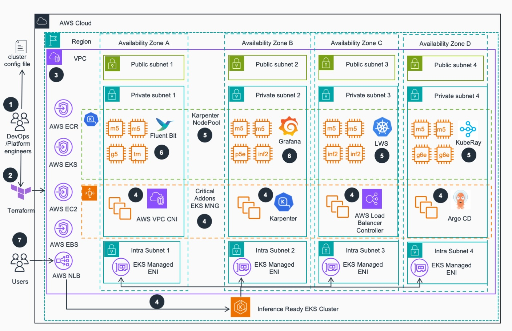

# Inference-Ready EKS Cluster

The Inference-Ready EKS Cluster is a pre-configured infrastructure solution designed specifically for AI/ML inference
workloads. This solution provides a Kubernetes cluster with all the necessary components to deploy and run inference
services using the AI on EKS [inference charts](../blueprints/inference/inference-charts.md) or your own deployments
and models.

An expanded [Readme](https://github.com/awslabs/ai-on-eks/tree/main/infra/solutions/inference-ready-cluster/README.md)
is available that dives deep into the infrastructure. This page highlights the core components and reasoning for this
architecture.

## Why?

This Inference-Ready EKS Cluster was created to enable anyone to use EKS for inference, no matter where they are on
their journey. LLMs can be challenging to deploy: depending on the model size, architecture, capabilities, and your
requirements, different tools are needed to properly deploy, run, and scale the model. Additionally, you may want to run
models that aren't just LLMs, such as text -> image diffusion models or more traditional Machine Learning models.

This infrastructure is meant to be the first layer of support. Alongside
the [Inference Charts](../blueprints/inference/inference-charts.md) and the Guidance you'll also find in this
repository, AI on EKS aims to equip you with all the tools and knowledge you need to be able to run the inference you
want.

## Use Cases

- **Single Model Testing**: If you just want to deploy a model and test it to see what it does or how well it does.
- **Multi-Node Distributed Inference**: If the model is too big to fit on a single node.
- **Model Autoscaling**: If you need to dynamically adjust the amount of models running based on incoming requests and
  queue length.
- **Model Benchmarking**: If you want to understand how your model will perform on a given dataset with differing
  traffic patterns. This helps you adjust the model parameters and replicas to meet your Service Level Objectives (
  SLOs).
- **Muti Model Architectures**: If you want to test both LLMs and text->image diffusion models.

## Introduction

This infrastructure creates an Amazon EKS cluster optimized for AI/ML inference workloads with the following key
features:

- **KubeRay Operator**: Enables distributed Ray workloads for scalable inference
- **LeaderWorkerSet**: Enables multi-node distributed inference
- **AIBrix Stack**: Advanced inference optimization and management capabilities
- **GPU/Neuron Support**: Ready for both NVIDIA GPU and AWS Neuron (Inferentia/Trainium) workloads
- **AI/ML Observability Stack**: Comprehensive monitoring and observability for ML workloads
- **Autoscaling**: Karpenter-based node autoscaling for cost optimization

The cluster is specifically designed to work seamlessly with the AI on
EKS [Inference Charts](../blueprints/inference/inference-charts.md), providing a complete end-to-end solution for
deploying inference workloads.

## Resources

This infrastructure deploys the following AWS resources:

### Core Infrastructure

- **[Amazon VPC](https://aws.amazon.com/vpc/)** with public and private subnets across multiple AZs
- **[Amazon EKS Cluster](https://aws.amazon.com/eks/)** (v1.33 by default)
- **[EKS Managed Node Groups](https://docs.aws.amazon.com/eks/latest/userguide/managed-node-groups.html)**: Auto-scaling
  groups of EC2 instances that serve as EKS compute nodes.
- **NAT Gateways** for private subnet internet access
- **Internet Gateway** for public subnet access
- **Security Groups** with appropriate ingress/egress rules

### EKS Add-ons

- **[AWS Load Balancer Controller](https://aws.amazon.com/blogs/networking-and-content-delivery/deploying-aws-load-balancer-controller-on-amazon-eks/)** for ingress management
- **EBS CSI Driver** for persistent storage
- **VPC CNI** for pod networking
- **CoreDNS** for service discovery
- **Kube-proxy** for service networking
- **Metrics Server** for resource metrics
- **Amazon CloudWatch Observability** for logging and monitoring

### AI/ML Specific Components

- **KubeRay Operator** for distributed Ray workloads
- **LeaderWorkerSet** for multi-node distributed inference
- **NVIDIA Device Plugin** for GPU resource management
- **AWS Neuron Device Plugin** for Inferentia/Trainium support
- **Karpenter** for intelligent node autoscaling

### Observability Stack

- **Prometheus** for metrics collection
- **Grafana** for visualization and dashboards
- **AlertManager** for alerting
- **Node Exporter** for node-level metrics
- **DCGM Exporter** for GPU metrics (when GPU nodes are present)

### AIBrix Components

- **AIBrix Core** for inference optimization
- **Gateway and routing** for traffic management
- **Performance monitoring** and optimization tools

## Deployment

### Architecture Diagram



### Prerequisites

1. **AWS CLI** configured with appropriate permissions
2. **Terraform** (>= 1.0)
3. **kubectl** for cluster management
4. **Helm** (>= 3.0) for chart deployments

### Step 0: Clone and Navigate

```bash
git clone https://github.com/awslabs/ai-on-eks.git
cd infra/solutions/inference-ready-cluster
```

### Step 1: (Optional) Configure Variables

Edit the `terraform/blueprint.tfvars` file to customize your deployment:

```hcl
name                             = "my-inference-cluster"
region                           = "us-west-2"
enable_kuberay_operator          = true
enable_ai_ml_observability_stack = true
enable_aibrix_stack              = true
enable_leader_worker_set         = true
availability_zones_count         = 4
```

All variables can be found in the [
`variables.tf` file](https://github.com/awslabs/ai-on-eks/blob/main/infra/base/terraform/variables.tf)

### Step 2: Deploy Infrastructure

```bash
# Run the installation script
./install.sh
```

The installation script will do the following automatically:

1. Copy the base Terraform configuration
2. Initialize Terraform
3. Plan and apply the infrastructure
4. Configure kubectl context

### Step 3: VPC

An Amazon Virtual Private Network (VPC) is provisioned and configured based on specified configuration. According to
best practices for Reliability, 4 Availability zones (AZs) are configured to provide the best chance of node acquisition
and high availability. Topology awareness defaults to keep AI/ML workloads in the same AZ for performance/cost, but is
configurable for availability.

### Step 4: EKS

Amazon Elastic Kubernetes Service (EKS) cluster is provisioned with Managed Nodes Group (MNG) that run critical cluster
add-ons (CoreDNS, AWS Load Balancer Controller and Karpenter) on its compute nodes. Karpenter will manage compute
capacity to other EKS add-ons, as well as inference applications that will be deployed by user while prioritizing the
most cost-effective instances, per configuration.

### Step 5: EKS add-ons

Other important EKS add-ons (LWS, KubeRay etc.) are deployed based on the configurations defined in the per-environment
Terraform configuration file (See Step 1 above)

### Step 6: Observability

An observability stack including FluentBit, Prometheus and Grafana is deployed to collect metrics and logs from the
environment. Service and Pod Monitors are deployed to watch for AI/ML related workloads and collect metrics. Grafana
dashboards are configured to automatically visualize the metrics and logs side by side.

### Step 7: Cluster Ready

Users can access EKS API and can deploy containerized AI/ML inference workloads via Kubernetes CLI using the AI on EKS
[inference charts](../blueprints/inference/inference-charts.md) or other repositories by interacting with AWS Network
Load Balancer (NLB) endpoint.

### Step 8: Verify Deployment

To validate that everything deployed properly, you can run

```bash
kubectl get svc,pod,deployment -A
```

You should see the following output (expand the section to see the output)

<details>

```text
    NAMESPACE              NAME                                                             TYPE           CLUSTER-IP       EXTERNAL-IP                                                                     PORT(S)                                        AGE
    aibrix-system          service/aibrix-controller-manager-metrics-service                ClusterIP      172.20.218.39    <none>                                                                          8080/TCP                                       13d
    aibrix-system          service/aibrix-gateway-plugins                                   ClusterIP      172.20.142.245   <none>                                                                          50052/TCP                                      13d
    aibrix-system          service/aibrix-gpu-optimizer                                     ClusterIP      172.20.14.220    <none>                                                                          8080/TCP                                       13d
    aibrix-system          service/aibrix-kuberay-operator                                  ClusterIP      172.20.240.255   <none>                                                                          8080/TCP                                       13d
    aibrix-system          service/aibrix-metadata-service                                  ClusterIP      172.20.252.24    <none>                                                                          8090/TCP                                       13d
    aibrix-system          service/aibrix-redis-master                                      ClusterIP      172.20.155.43    <none>                                                                          6379/TCP                                       13d
    argocd                 service/argocd-applicationset-controller                         ClusterIP      172.20.139.94    <none>                                                                          7000/TCP                                       13d
    argocd                 service/argocd-dex-server                                        ClusterIP      172.20.127.60    <none>                                                                          5556/TCP,5557/TCP                              13d
    argocd                 service/argocd-redis                                             ClusterIP      172.20.48.202    <none>                                                                          6379/TCP                                       13d
    argocd                 service/argocd-repo-server                                       ClusterIP      172.20.232.147   <none>                                                                          8081/TCP                                       13d
    argocd                 service/argocd-server                                            ClusterIP      172.20.233.191   <none>                                                                          80/TCP,443/TCP                                 13d
    default                service/etcd-client                                              ClusterIP      172.20.47.224    <none>                                                                          2379/TCP                                       12d
    default                service/etcd-server                                              ClusterIP      172.20.69.95     <none>                                                                          2379/TCP,2380/TCP                              12d
    default                service/kubernetes                                               ClusterIP      172.20.0.1       <none>                                                                          443/TCP                                        13d
    envoy-gateway-system   service/envoy-aibrix-system-aibrix-eg-903790dc                   ClusterIP      172.20.249.100   <none>                                                                          80/TCP                                         13d
    envoy-gateway-system   service/envoy-gateway                                            ClusterIP      172.20.113.229   <none>                                                                          18000/TCP,18001/TCP,18002/TCP,19001/TCP        13d
    ingress-nginx          service/ingress-nginx-controller                                 LoadBalancer   172.20.27.209    k8s-ingressn-ingressn-ffa534dcb1-b4b54bcc24eaeddd.elb.us-west-2.amazonaws.com   80:31646/TCP,443:32024/TCP                     13d
    ingress-nginx          service/ingress-nginx-controller-admission                       ClusterIP      172.20.249.118   <none>                                                                          443/TCP                                        13d
    karpenter              service/karpenter                                                ClusterIP      172.20.149.70    <none>                                                                          8080/TCP                                       13d
    kube-system            service/aws-load-balancer-webhook-service                        ClusterIP      172.20.83.104    <none>                                                                          443/TCP                                        13d
    kube-system            service/eks-extension-metrics-api                                ClusterIP      172.20.87.142    <none>                                                                          443/TCP                                        13d
    kube-system            service/k8s-neuron-scheduler                                     ClusterIP      172.20.248.128   <none>                                                                          12345/TCP                                      13d
    kube-system            service/kube-dns                                                 ClusterIP      172.20.0.10      <none>                                                                          53/UDP,53/TCP,9153/TCP                         13d
    kube-system            service/kube-prometheus-stack-kubelet                            ClusterIP      None             <none>                                                                          10250/TCP,10255/TCP,4194/TCP                   13d
    kuberay-operator       service/kuberay-operator                                         ClusterIP      172.20.117.159   <none>                                                                          8080/TCP                                       13d
    lws-system             service/lws-controller-manager-metrics-service                   ClusterIP      172.20.17.186    <none>                                                                          8443/TCP                                       13d
    lws-system             service/lws-webhook-service                                      ClusterIP      172.20.173.201   <none>                                                                          443/TCP                                        13d
    monitoring             service/alertmanager-operated                                    ClusterIP      None             <none>                                                                          9093/TCP,9094/TCP,9094/UDP                     13d
    monitoring             service/dcgm-exporter                                            ClusterIP      172.20.79.5      <none>                                                                          9400/TCP                                       13d
    monitoring             service/fluent-bit                                               ClusterIP      172.20.111.213   <none>                                                                          2020/TCP                                       13d
    monitoring             service/kube-prometheus-stack-alertmanager                       ClusterIP      172.20.45.163    <none>                                                                          9093/TCP,8080/TCP                              13d
    monitoring             service/kube-prometheus-stack-coredns                            ClusterIP      None             <none>                                                                          9153/TCP                                       13d
    monitoring             service/kube-prometheus-stack-grafana                            ClusterIP      172.20.251.144   <none>                                                                          80/TCP                                         13d
    monitoring             service/kube-prometheus-stack-kube-controller-manager            ClusterIP      None             <none>                                                                          10257/TCP                                      13d
    monitoring             service/kube-prometheus-stack-kube-etcd                          ClusterIP      None             <none>                                                                          2381/TCP                                       13d
    monitoring             service/kube-prometheus-stack-kube-proxy                         ClusterIP      None             <none>                                                                          10249/TCP                                      13d
    monitoring             service/kube-prometheus-stack-kube-scheduler                     ClusterIP      None             <none>                                                                          10259/TCP                                      13d
    monitoring             service/kube-prometheus-stack-kube-state-metrics                 ClusterIP      172.20.81.57     <none>                                                                          8080/TCP                                       13d
    monitoring             service/kube-prometheus-stack-operator                           ClusterIP      172.20.163.90    <none>                                                                          443/TCP                                        13d
    monitoring             service/kube-prometheus-stack-prometheus                         ClusterIP      172.20.1.251     <none>                                                                          9090/TCP,8080/TCP                              13d
    monitoring             service/kube-prometheus-stack-prometheus-node-exporter           ClusterIP      172.20.88.160    <none>                                                                          9100/TCP                                       13d
    monitoring             service/my-cluster                                               ClusterIP      172.20.54.44     <none>                                                                          9200/TCP,9300/TCP,9600/TCP,9650/TCP            13d
    monitoring             service/my-cluster-dashboards                                    ClusterIP      172.20.161.35    <none>                                                                          5601/TCP                                       13d
    monitoring             service/my-cluster-masters                                       ClusterIP      None             <none>                                                                          9200/TCP,9300/TCP                              13d
    monitoring             service/opencost                                                 ClusterIP      172.20.162.78    <none>                                                                          9003/TCP,9090/TCP                              13d
    monitoring             service/opensearch-discovery                                     ClusterIP      None             <none>                                                                          9300/TCP                                       13d
    monitoring             service/opensearch-operator-controller-manager-metrics-service   ClusterIP      172.20.183.236   <none>                                                                          8443/TCP                                       13d
    monitoring             service/prometheus-operated                                      ClusterIP      None             <none>                                                                          9090/TCP                                       13d

    NAMESPACE              NAME                                                                  READY   STATUS      RESTARTS        AGE
    aibrix-system          pod/aibrix-controller-manager-5948f8f8b7-qjm7z                        1/1     Running     0               13d
    aibrix-system          pod/aibrix-gateway-plugins-5978d98445-qj2jw                           1/1     Running     0               13d
    aibrix-system          pod/aibrix-gpu-optimizer-64c978ddd8-bw7hk                             1/1     Running     0               13d
    aibrix-system          pod/aibrix-kuberay-operator-8b65d7cc4-xrcm6                           1/1     Running     0               13d
    aibrix-system          pod/aibrix-metadata-service-5499dc64b7-69tzc                          1/1     Running     0               13d
    aibrix-system          pod/aibrix-redis-master-576767646c-w9lhl                              1/1     Running     0               13d
    argocd                 pod/argocd-application-controller-0                                   1/1     Running     0               13d
    argocd                 pod/argocd-applicationset-controller-6847f76cb8-svwvt                 1/1     Running     0               13d
    argocd                 pod/argocd-dex-server-f6d74975f-g5rj8                                 1/1     Running     0               13d
    argocd                 pod/argocd-notifications-controller-86f4bb887d-sgxlb                  1/1     Running     0               13d
    argocd                 pod/argocd-redis-588f9bcd4d-9tncd                                     1/1     Running     0               13d
    argocd                 pod/argocd-repo-server-5cbcc778f4-kd4ll                               1/1     Running     0               13d
    argocd                 pod/argocd-server-7c9898bc58-vfqwn                                    1/1     Running     0               13d
    envoy-gateway-system   pod/envoy-aibrix-system-aibrix-eg-903790dc-567ff75b87-22ctt           2/2     Running     0               13d
    envoy-gateway-system   pod/envoy-gateway-6d7859b6bf-6hhf5                                    1/1     Running     0               13d
    ingress-nginx          pod/ingress-nginx-controller-58f4c5584-wt6rk                          1/1     Running     0               13d
    karpenter              pod/karpenter-849fd44788-4fgml                                        1/1     Running     0               13d
    karpenter              pod/karpenter-849fd44788-zbm9z                                        1/1     Running     0               13d
    kube-system            pod/aws-load-balancer-controller-c495bf799-crnlh                      1/1     Running     0               13d
    kube-system            pod/aws-load-balancer-controller-c495bf799-nwkqv                      1/1     Running     0               13d
    kube-system            pod/aws-node-6ff6l                                                    2/2     Running     0               8d
    kube-system            pod/aws-node-728vt                                                    2/2     Running     0               2d16h
    kube-system            pod/aws-node-87jfl                                                    2/2     Running     0               13d
    kube-system            pod/aws-node-wtnlj                                                    2/2     Running     0               13d
    kube-system            pod/aws-node-zzc4g                                                    2/2     Running     0               2d16h
    kube-system            pod/coredns-7bf648ff5d-98bp4                                          1/1     Running     0               13d
    kube-system            pod/coredns-7bf648ff5d-w56nm                                          1/1     Running     0               13d
    kube-system            pod/ebs-csi-controller-5bdc7bfdb6-79658                               6/6     Running     0               13d
    kube-system            pod/ebs-csi-controller-5bdc7bfdb6-958zf                               6/6     Running     0               13d
    kube-system            pod/ebs-csi-node-4z2mb                                                3/3     Running     0               13d
    kube-system            pod/ebs-csi-node-8qq2s                                                3/3     Running     0               2d16h
    kube-system            pod/ebs-csi-node-q9h5r                                                3/3     Running     0               2d16h
    kube-system            pod/ebs-csi-node-t77j9                                                3/3     Running     0               13d
    kube-system            pod/ebs-csi-node-w9mh8                                                3/3     Running     0               8d
    kube-system            pod/eks-pod-identity-agent-jjfz4                                      1/1     Running     0               13d
    kube-system            pod/eks-pod-identity-agent-jthdk                                      1/1     Running     0               2d16h
    kube-system            pod/eks-pod-identity-agent-ng556                                      1/1     Running     0               8d
    kube-system            pod/eks-pod-identity-agent-q6ths                                      1/1     Running     0               2d16h
    kube-system            pod/eks-pod-identity-agent-rwkr9                                      1/1     Running     0               13d
    kube-system            pod/k8s-neuron-scheduler-56f6c8bd67-hbzgz                             1/1     Running     0               13d
    kube-system            pod/kube-proxy-4wf7s                                                  1/1     Running     0               2d16h
    kube-system            pod/kube-proxy-7dm2x                                                  1/1     Running     0               2d16h
    kube-system            pod/kube-proxy-9d9cm                                                  1/1     Running     0               8d
    kube-system            pod/kube-proxy-lt4sp                                                  1/1     Running     0               13d
    kube-system            pod/kube-proxy-nklwj                                                  1/1     Running     0               13d
    kube-system            pod/my-scheduler-6959876cb4-gprm5                                     1/1     Running     0               13d
    kuberay-operator       pod/kuberay-operator-6d988d7dd9-ncx4h                                 1/1     Running     0               13d
    lws-system             pod/lws-controller-manager-cbb85458b-7cvhr                            1/1     Running     0               13d
    lws-system             pod/lws-controller-manager-cbb85458b-dqj8g                            1/1     Running     0               13d
    monitoring             pod/alertmanager-kube-prometheus-stack-alertmanager-0                 2/2     Running     0               13d
    monitoring             pod/fluent-bit-52m29                                                  1/1     Running     0               2d16h
    monitoring             pod/fluent-bit-hb824                                                  1/1     Running     0               13d
    monitoring             pod/fluent-bit-hsptw                                                  1/1     Running     0               13d
    monitoring             pod/fluent-bit-nkmrq                                                  1/1     Running     0               8d
    monitoring             pod/fluent-bit-qdsm2                                                  1/1     Running     0               2d16h
    monitoring             pod/fluent-operator-7f75b8ccf4-z5924                                  1/1     Running     0               13d
    monitoring             pod/kube-prometheus-stack-grafana-c64f79c4f-zqlm7                     3/3     Running     0               13d
    monitoring             pod/kube-prometheus-stack-kube-state-metrics-77976dc6c4-fff28         1/1     Running     0               13d
    monitoring             pod/kube-prometheus-stack-operator-6655669d75-4kh9s                   1/1     Running     0               13d
    monitoring             pod/kube-prometheus-stack-prometheus-node-exporter-7xbrs              1/1     Running     0               13d
    monitoring             pod/kube-prometheus-stack-prometheus-node-exporter-gwkb2              1/1     Running     0               13d
    monitoring             pod/kube-prometheus-stack-prometheus-node-exporter-k6zl7              1/1     Running     0               2d16h
    monitoring             pod/kube-prometheus-stack-prometheus-node-exporter-pl6m7              1/1     Running     0               2d16h
    monitoring             pod/kube-prometheus-stack-prometheus-node-exporter-st9kp              1/1     Running     0               8d
    monitoring             pod/opencost-bd64bfbf5-jbfvr                                          2/2     Running     0               13d
    monitoring             pod/opensearch-dashboards-84675f8b9-6jd2h                             1/1     Running     0               13d
    monitoring             pod/opensearch-dashboards-84675f8b9-9mcs2                             1/1     Running     0               13d
    monitoring             pod/opensearch-masters-0                                              1/1     Running     0               13d
    monitoring             pod/opensearch-masters-1                                              1/1     Running     0               8d
    monitoring             pod/opensearch-masters-2                                              1/1     Running     0               8d
    monitoring             pod/opensearch-operator-controller-manager-58b76955b9-w46gl           2/2     Running     0               13d
    monitoring             pod/opensearch-securityconfig-update-4fdcz                            0/1     Completed   0               13d
    monitoring             pod/prometheus-kube-prometheus-stack-prometheus-0                     2/2     Running     0               13d
    nvidia-device-plugin   pod/nvidia-device-plugin-node-feature-discovery-master-77b96ddp8h25   1/1     Running     0               13d

    NAMESPACE              NAME                                                                 READY   UP-TO-DATE   AVAILABLE   AGE
    aibrix-system          deployment.apps/aibrix-controller-manager                            1/1     1            1           13d
    aibrix-system          deployment.apps/aibrix-gateway-plugins                               1/1     1            1           13d
    aibrix-system          deployment.apps/aibrix-gpu-optimizer                                 1/1     1            1           13d
    aibrix-system          deployment.apps/aibrix-kuberay-operator                              1/1     1            1           13d
    aibrix-system          deployment.apps/aibrix-metadata-service                              1/1     1            1           13d
    aibrix-system          deployment.apps/aibrix-redis-master                                  1/1     1            1           13d
    argocd                 deployment.apps/argocd-applicationset-controller                     1/1     1            1           13d
    argocd                 deployment.apps/argocd-dex-server                                    1/1     1            1           13d
    argocd                 deployment.apps/argocd-notifications-controller                      1/1     1            1           13d
    argocd                 deployment.apps/argocd-redis                                         1/1     1            1           13d
    argocd                 deployment.apps/argocd-repo-server                                   1/1     1            1           13d
    argocd                 deployment.apps/argocd-server                                        1/1     1            1           13d
    envoy-gateway-system   deployment.apps/envoy-aibrix-system-aibrix-eg-903790dc               1/1     1            1           13d
    envoy-gateway-system   deployment.apps/envoy-gateway                                        1/1     1            1           13d
    ingress-nginx          deployment.apps/ingress-nginx-controller                             1/1     1            1           13d
    karpenter              deployment.apps/karpenter                                            2/2     2            2           13d
    kube-system            deployment.apps/aws-load-balancer-controller                         2/2     2            2           13d
    kube-system            deployment.apps/coredns                                              2/2     2            2           13d
    kube-system            deployment.apps/ebs-csi-controller                                   2/2     2            2           13d
    kube-system            deployment.apps/k8s-neuron-scheduler                                 1/1     1            1           13d
    kube-system            deployment.apps/my-scheduler                                         1/1     1            1           13d
    kuberay-operator       deployment.apps/kuberay-operator                                     1/1     1            1           13d
    lws-system             deployment.apps/lws-controller-manager                               2/2     2            2           13d
    monitoring             deployment.apps/fluent-operator                                      1/1     1            1           13d
    monitoring             deployment.apps/kube-prometheus-stack-grafana                        1/1     1            1           13d
    monitoring             deployment.apps/kube-prometheus-stack-kube-state-metrics             1/1     1            1           13d
    monitoring             deployment.apps/kube-prometheus-stack-operator                       1/1     1            1           13d
    monitoring             deployment.apps/opencost                                             1/1     1            1           13d
    monitoring             deployment.apps/opensearch-dashboards                                2/2     2            2           13d
    monitoring             deployment.apps/opensearch-operator-controller-manager               1/1     1            1           13d
    nvidia-device-plugin   deployment.apps/nvidia-device-plugin-node-feature-discovery-master   1/1     1            1           13d
```

</details>

## Inference on EKS

EKS is a powerful platform for running AI/ML inference. For a deep dive on many of the inference possibilities on EKS,
please check the [inference](../blueprints/inference/index.md) section.

### Inference Charts Integration

This infrastructure is specifically designed to work with the AI on EKS Inference Charts. The cluster provides all the
necessary components and configurations for seamless deployment of inference workloads.

#### Prerequisites for Inference Charts

The infrastructure automatically provides:

1. **KubeRay Operator** - Required for Ray-vLLM deployments
2. **GPU/Neuron Device Plugins** - For hardware resource management
3. **Observability Stack** - Prometheus and Grafana for monitoring
4. **AIBrix Integration** - For inference optimization and management

#### Supported Inference Patterns

The cluster supports all inference patterns provided by the inference charts:

##### vLLM Deployments

- Direct vLLM deployment using Kubernetes Deployment
- Suitable for single-node inference workloads
- Supports both GPU and Neuron accelerators

##### Ray-vLLM Deployments

- Distributed vLLM on Ray Serve
- Automatic scaling based on workload demand
- Advanced observability with Prometheus/Grafana integration
- Topology-aware scheduling for optimal performance

##### AIBrix Deployments

- AIBrix backed LLM deployments
- Efficient LLM routing for multiple replicas
- Supports mixed GPU and Neuron accelerators

### Example Deployments

Once your cluster is ready, you can deploy inference workloads:

```bash
# Navigate to inference charts
cd ../../../blueprints/inference/inference-charts

# Create Hugging Face token secret
kubectl create secret generic hf-token --from-literal=token=your_hf_token

# Deploy GPU Ray-vLLM with Llama model
helm install llama-inference . \
  --values values-llama-32-1b-ray-vllm.yaml

# Deploy Neuron vLLM with optimized model
helm install neuron-inference . \
  --values values-llama-31-8b-vllm-neuron.yaml
```

Please check the [inference charts](../blueprints/inference/inference-charts.md) section for a deeper look at what is
available.

### Observability Integration

The infrastructure provides comprehensive observability for inference workloads:

- **Prometheus Metrics**: Automatic collection of inference metrics
- **Grafana Dashboards**: Pre-configured dashboards for Ray and vLLM
- **Log Aggregation**: Centralized logging with Fluent Bit
- **GPU/Neuron Monitoring**: Hardware utilization metrics

Access Grafana dashboard:

```bash
kubectl port-forward -n monitoring svc/kube-prometheus-stack-grafana 3000:80
```

Please see the [observability](../guidance/observability.md) for an in-depth look at using the observability
features.

### Cost Optimization

The cluster includes several cost optimization features:

1. **Karpenter Autoscaling**: Automatic node provisioning and deprovisioning
2. **Spot Instance Support**: Configure node groups to use spot instances
3. **Topology Awareness**: Efficient resource utilization across AZs
4. **Resource Limits**: Proper resource requests and limits for workloads

### Troubleshooting

This section covers common issues you may encounter when deploying and operating the inference-ready EKS cluster, along
with detailed solutions and diagnostic steps.

### Deployment Issues

#### 1. Terraform Apply Failures

**Symptoms:**

- Terraform fails during `terraform apply` with resource creation errors
- Module-specific failures during sequential deployment

**Common Causes & Solutions:**

**Insufficient AWS Permissions:**

```bash
# Verify your AWS credentials and permissions
aws sts get-caller-identity
aws iam get-user

# Required permissions include:
# - EKS cluster creation and management
# - EC2 instance management
# - VPC and networking resources
# - IAM role creation and attachment
# - KMS key management
```

**Service Quota Limits:**

```bash
# Check EC2 service quotas
aws service-quotas get-service-quota --service-code ec2 --quota-code L-1216C47A  # Running On-Demand instances
aws service-quotas get-service-quota --service-code ec2 --quota-code L-34B43A08  # Running On-Demand G instances
aws service-quotas get-service-quota --service-code ec2 --quota-code L-6E869C2A  # Running On-Demand Inf instances

# Request quota increases if needed
aws service-quotas request-service-quota-increase --service-code ec2 --quota-code L-34B43A08 --desired-value 32
```

**Region Availability:**

```bash
# Verify instance types are available in your region
aws ec2 describe-instance-type-offerings --location-type availability-zone --filters Name=instance-type,Values=g5.xlarge,inf2.xlarge
```

#### 2. EKS Cluster Creation Issues

**Symptoms:**

- EKS cluster fails to create or becomes stuck in "CREATING" state
- Node groups fail to join the cluster

**Diagnostic Steps:**

```bash
# Check cluster status
aws eks describe-cluster --name inference-cluster --region us-west-2
```

**Common Solutions:**

- Ensure VPC has sufficient IP addresses across 4 availability zones
- Verify NAT Gateway creation in public subnets
- Check security group configurations allow required EKS communication

### Node and Pod Issues

#### 3. Pods Stuck in Pending State

**Symptoms:**

- Inference workloads remain in "Pending" status
- Karpenter not provisioning nodes

**Diagnostic Commands:**

```bash
# Check pod events and resource requests
kubectl describe pod <pod-name> -n <namespace>

# Check Karpenter logs
kubectl logs -n karpenter deployment/karpenter

# Check available nodes and their capacity
kubectl get nodes -o wide
kubectl describe nodes
```

**Common Causes & Solutions:**

**Insufficient GPU/Neuron Quotas:**

```bash
# Verify Karpenter NodePool configurations
kubectl get nodepool -o yaml
```

#### 4. GPU Detection and Device Plugin Issues

**Symptoms:**

- GPU nodes show 0 allocatable GPUs
- NVIDIA device plugin not running

**Diagnostic Steps:**

```bash
# Verify GPU visibility on nodes
kubectl get nodes -o json | jq '.items[] | {name: .metadata.name, gpus: .status.allocatable["nvidia.com/gpu"]}'

# Check node labels
kubectl get nodes --show-labels | grep gpu
```

**Solutions:**

```bash
# Restart NVIDIA device plugin if needed
kubectl delete pods -n nvidia-device-plugin -l app.kubernetes.io/name=nvidia-device-plugin
```

#### 5. AWS Neuron Setup Issues

**Symptoms:**

- Neuron devices not detected on inf2/trn1 instances
- Neuron device plugin failing

**Diagnostic Commands:**

```bash
# Check Neuron device plugin
kubectl get pods -n kube-system | grep neuron

# Verify Neuron devices
kubectl get nodes -o json | jq '.items[] | {name: .metadata.name, neuron: .status.allocatable["aws.amazon.com/neuron"]}'

# Check Neuron scheduler
kubectl get pods -n kube-system | grep my-scheduler
```

**Solutions:**

```bash
# Verify Neuron runtime installation
kubectl describe node <inf2-node> | grep neuron

# Check Neuron device plugin logs
kubectl logs -n kube-system <neuron-device-plugin-pod>
```

### Model Deployment Issues

#### 6. Model Download Failures

**Symptoms:**

- Pods fail to start with image pull or model download errors
- Hugging Face authentication failures

**Diagnostic Steps:**

```bash
# Check pod logs for download errors
kubectl logs <pod-name> -n <namespace>

# Verify Hugging Face token secret
kubectl get secret hf-token -o yaml
kubectl get secret hf-token -o jsonpath='{.data.token}' | base64 -d
```

**Solutions:**

```bash
# Recreate Hugging Face token secret
kubectl delete secret hf-token
kubectl create secret generic hf-token --from-literal=token=<your-hf-token>

# Check internet connectivity from pods
kubectl run test-pod --image=curlimages/curl -it --rm -- curl -I https://huggingface.co
```

#### 7. Out of Memory (OOM) Issues

**Symptoms:**

- Pods getting killed with OOMKilled status
- Models failing to load completely

**Diagnostic Commands:**

```bash
# Check pod resource usage
kubectl top pods -n <namespace>

# Check node memory usage
kubectl top nodes

# Review pod events for OOM kills
kubectl get events --field-selector reason=OOMKilling
```

**Solutions:**

```bash
# Increase instance type to get larger GPU
# Consider using larger instance types or model sharding
```

### Networking and Load Balancer Issues

#### 8. Service Connectivity Problems

**Symptoms:**

- Cannot access inference endpoints
- Load balancer not provisioning

**Diagnostic Steps:**

```bash
# Check service status
kubectl get svc -A

# Check AWS Load Balancer Controller
kubectl logs -n kube-system deployment/aws-load-balancer-controller

# Verify security groups and NACLs
aws ec2 describe-security-groups --filters "Name=group-name,Values=*inference-cluster*"
```

**Solutions:**

```bash
# Restart AWS Load Balancer Controller
kubectl rollout restart deployment/aws-load-balancer-controller -n kube-system

# Check ingress annotations and configurations
kubectl describe ingress <ingress-name>
```

### Monitoring and Observability Issues

#### 9. Prometheus/Grafana Not Working

**Symptoms:**

- Monitoring dashboards not accessible
- Metrics not being collected

**Diagnostic Commands:**

```bash
# Check monitoring stack pods
kubectl get pods -n monitoring

# Check Prometheus targets
kubectl port-forward -n monitoring svc/kube-prometheus-stack-prometheus 9090:9090
# Navigate to http://localhost:9090/targets

# Check Grafana access
kubectl port-forward -n monitoring svc/kube-prometheus-stack-grafana 3000:80
# Navigate to http://localhost:3000
```

**Solutions:**

```bash
# Restart monitoring components
kubectl rollout restart deployment/kube-prometheus-stack-grafana -n monitoring

# Check service monitors
kubectl get servicemonitor -A
```

### Performance and Scaling Issues

#### 10. Slow Model Inference

**Symptoms:**

- High latency in model responses
- Poor throughput performance

**Diagnostic Steps:**

```bash
# Check resource utilization
kubectl top pods -n <namespace> --containers

# Monitor GPU utilization (if using GPUs)
kubectl exec -it <pod-name> -- nvidia-smi
```

**Solutions:**

- Verify model is using appropriate hardware acceleration
- Check if multiple models are competing for resources
- Optimize model parameters for latency
- Scale up model and use load balancing

### General Debugging Commands

```bash
# Get cluster information
kubectl cluster-info
kubectl get nodes -o wide

# Check all system pods
kubectl get pods -A | grep -v Running

# View recent events
kubectl get events --sort-by='.lastTimestamp' -A

# Check Karpenter provisioning
kubectl logs -n karpenter deployment/karpenter --tail=100

# Verify EKS add-ons
aws eks describe-addon --cluster-name inference-cluster --addon-name vpc-cni
```

### Getting Additional Help

If you continue to experience issues:

1. **Check AWS Service Health**: Visit the [AWS Service Health Dashboard](https://status.aws.amazon.com/)
2. **Review CloudWatch Logs**: Check EKS control plane logs in CloudWatch
3. **Consult Documentation**: Refer to
   the [EKS Troubleshooting Guide](https://docs.aws.amazon.com/eks/latest/userguide/troubleshooting.html)
4. **Community Support**: Post questions in the [AI on EKS GitHub Issues](https://github.com/awslabs/ai-on-eks/issues)
